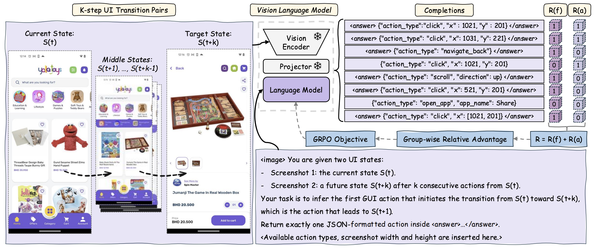
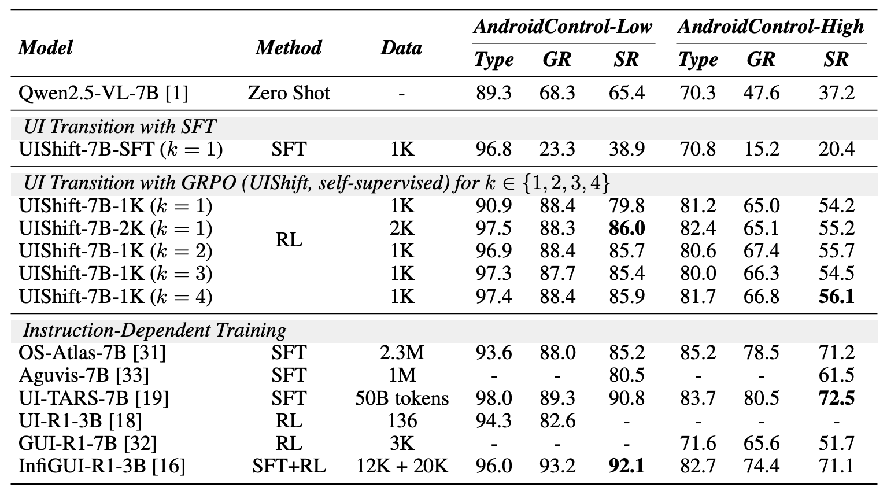
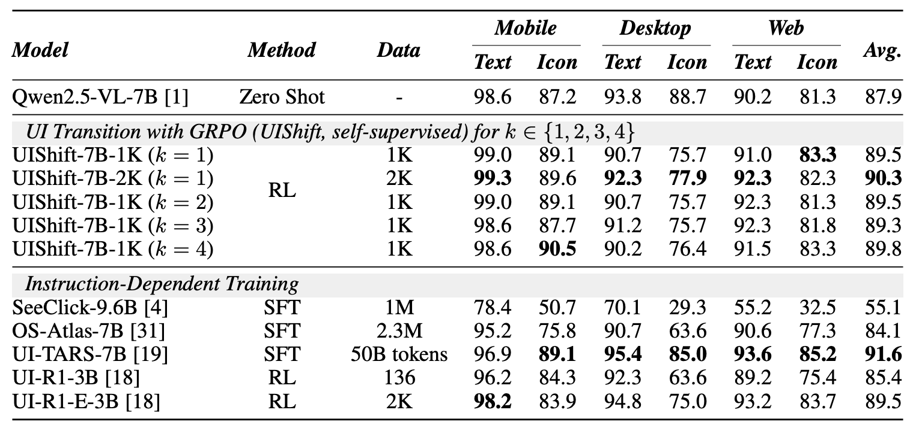

# UIShift: Enhancing VLM-based GUI Agents through **Self-supervised** Reinforcement Learning

<font size=4><div align='center' > [[📖 Paper](https://arxiv.org/abs/2505.12493)] [[🤗 UIShift-7B-2K](https://huggingface.co/mllmTeam/UIShift-7B-2K)] [[🤗 Daily Paper](https://huggingface.co/papers/2505.12493)]</div></font>

## 📝 Overview

***UI Transition***
To unlock the potential of unlabeled GUI trajectories, we propose a self-supervised training task for GUI agents, named *k-step UI Transition*. Specifically, each training sample consists of a pair of screenshots, $S_t$ and $S_{t+k}$, where $S_{t+k}$ is obtained by executing $k$ actions starting from state $S_t$.

***UIShift***
We introduce UIShift, a one-stage RL training framework that fine-tunes VLMs using GRPO solely on UI Transition data. Using only 2K UITransition samples, UIShift-7B with $k=1$ achieves 87.8% on ScreenSpot (96.7% on mobile subset), 90.3% on ScreenSpot-V2 (99.3% on mobile subset), 86.0% on AndroidControl-Low, and 55.2% on AndroidControl-High. No reasoning prompts are required during either training and inference.


<div align="center">
  
  <p><i>Overview of UIShift</i></p>
</div>

## 🔥 News
- ***`2025/6/18`*** We released the UIShift-7B model, code, and data.

- ***`2025/5/18`*** Our paper "[UIShift: Enhancing VLM-based GUI Agents through Self-supervised Reinforcement Learning](https://arxiv.org/abs/2505.12493)" was available on arXiv.

## 📈 Results

<div align="center">
  
  <p><i>Task automation performance on AndroidControl-Low and -High</i></p>
</div>


<div align="center">
  
  <p><i>Grounding performance on ScreenSpot-V2</i></p>
</div>

More evaluation results on ScreenSpot and ScreenSpot-Pro can be found in the [UIShift Paper](https://arxiv.org/abs/2505.12493).

## ⚙️ Usage

### Data Preparation

> We provide our 2K training samples for UIShift-7B ($k=1$) training [here](data/ui_transition_training_2000_k_1_no_reasoning.jsonl). These samples require no reasoning requirements for GRPO training. Since UI Transition is an annotation-free and easily scalable training task, we also provide the data processing workflow and corresponding scripts to support flexible scaling.

- **AndroidControl preparation**: Download the original [AndroidControl](https://console.cloud.google.com/storage/browser/gresearch/android_control) dataset in TFRecord format and convert it into episode-wise folders. We provide a reference script: [androidcontrol_parse.py](data/processing/androidcontrol_parse.py).

- **Metadata extraction**: Run [androidcontrol_metadata_extraction.py](data/processing/androidcontrol_metadata_extraction.py) to extract screenshot metadata, including `step instruction` and `groundtruth action`. Each screenshot is identified by its episode_id and step index. The output will be saved to a CSV file. You can modify the script to exclude specific action types during training. 

- **UI bbox extraction**: For `click` actions, UIShift assigns the correctness reward if the clicked point falls within the correct UI element. Since AndroidControl provides only the clicked point, we locate the smallest bounding box in the accessibility tree that contasin the point. See the reference script: [androidcontrol_ui_bbox_extraction.py](data/processing/androidcontrol_ui_bbox_extraction.py).

- **Training set conversion**: Once the metadata is prepared, it can be converted into the appropriate `json` or `jsonl` format depending on the training framework. We use [VLM-R1](https://github.com/om-ai-lab/VLM-R1) for UIShift training, and provide a reference script: [metadata_to_trainingset.py](data/processing/metadata_to_trainingset.py).

### Training

- Follow the installation instructions in [VLM-R1](https://github.com/om-ai-lab/VLM-R1).

- Replace the original `get_question_template()` in the `VLM-R1/src/open-r1-multimudal/src/open_r1/vlm_modules/qwen_module.py` with the following implementation **before starting GRPO training**. This ensures that **no reasoning prompts are appended** during training.

  ```python
  @staticmethod
  def get_question_template(task_type: str):
      match task_type:
          case "rec":
              return "{Question} First output the thinking process in <think> </think> tags and then output the final answer in <answer> </answer> tags. Output the final answer in JSON format."
          case "uishift_no_reasoning":
              return "{Question} Output the final answer in <answer> </answer> tags. Do not output any extra text."
          case _:
              return "{Question} First output the thinking process in <think> </think> tags and then output the final answer in <answer> </answer> tags."
  ```

- Copy [grpo_uishift.py](train/grpo_uishift.py) to `VLM-R1/src/open-r1-multimudal/src/open_r1/trainer`. This script implements the reward mechanism used during training.

- Copy [run_grpo_uishift.py](train/run_grpo_uishift.sh) to `VLM-R1/src/open-r1-multimudal/run_scripts`. This is the training launch script and contains the hyperparameters used in UIShift.

### Evaluation

The test set for AndroidControl is available [here](data/androidcontrol_test.csv), and the prompts used for evaluating both the Qwen2.5-VL baseline and UIShift are provided [here](eval/prompt.json).

## 🌟 Citation

If you find this work useful, welcome to cite our paper.

```
@article{gao2025uishift,
  title={UIShift: Enhancing VLM-based GUI Agents through Self-supervised Reinforcement Learning},
  author={Gao, Longxi and Zhang, Li and Xu, Mengwei},
  journal={arXiv preprint arXiv:2505.12493},
  year={2025}
}
```

## 💡 Acknowledgements

We would like to thank the following open-source projects for their valuable contributions: [DeepSeek-R1](https://github.com/deepseek-ai/DeepSeek-R1), [Qwen2.5-VL](https://github.com/QwenLM/Qwen2.5-VL), [VLM-R1](https://github.com/om-ai-lab/VLM-R1), [AndroidControl](https://console.cloud.google.com/storage/browser/gresearch/android_control), [ScreenSpot](https://huggingface.co/datasets/rootsautomation/ScreenSpot), [ScreenSpot-V2](https://huggingface.co/datasets/OS-Copilot/ScreenSpot-v2), and [ScreenSpot-Pro](https://huggingface.co/datasets/likaixin/ScreenSpot-Pro).